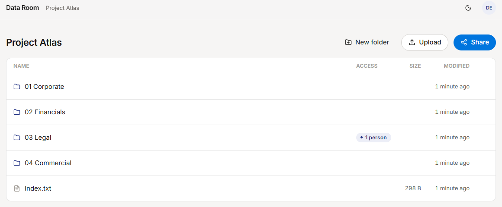
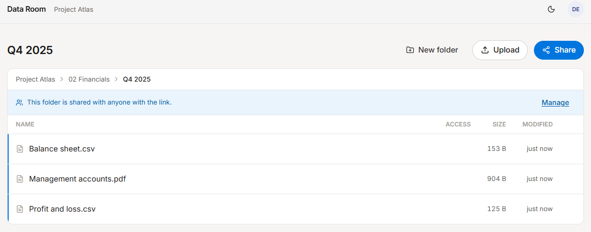
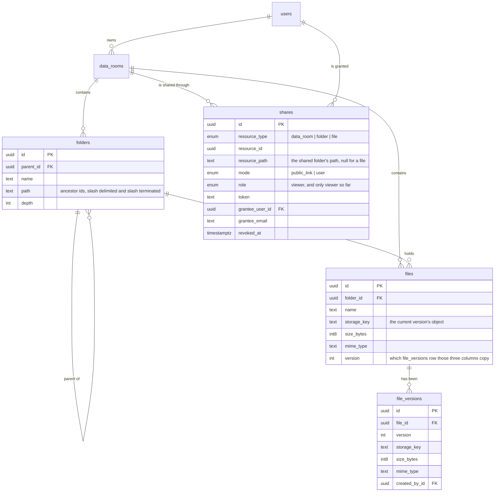
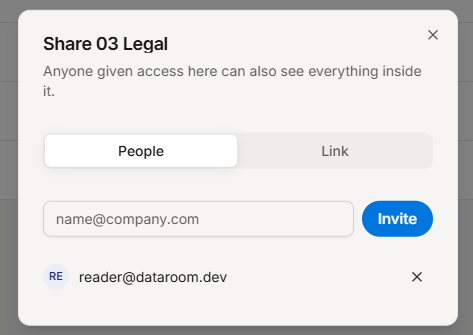
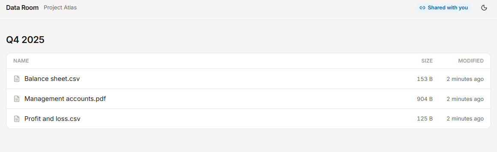

# Data Room

A virtual data room. Documents live in a private tree, and the owner decides who
can see which part of it: a person by email, or anyone holding a link. Access
granted on a folder reaches everything inside it and nothing beside it.

- Live: **https://nizar-dataroom.vercel.app**
- API: https://nizar-dataroom-api.vercel.app
- Public link, no account needed: **https://nizar-dataroom.vercel.app/l/atlas-q4-2025-review**
- Documentation, including the design system rendered rather than as source:
  **https://nizarkenny.github.io/dataroom/**



## Try it

| Account | Password | Sees |
| --- | --- | --- |
| `demo@dataroom.dev` | `dataroom-demo-2026` | owns Project Atlas |
| `reader@dataroom.dev` | `dataroom-demo-2026` | invited to `03 Legal` only |

Four things worth opening:

1. Sign in as the reader. The room opens at `03 Legal`, the folder they were
   given, and the breadcrumbs do not name the folders above it. The other three
   folders are not drawn at all; open one of their URLs from the owner's session
   and it answers 404, not 403.
2. As the owner, open `02 Financials / Q4 2025`. A banner says the folder is
   shared, and every row carries a rail on its left because its access came from
   the folder, not from the row.
3. Open History on `Management accounts.pdf`, in `02 Financials / Q4 2025`. It
   has been re-issued once, so there are two versions: either can be opened, and
   one click puts the older one back. Uploading a file whose name is already
   taken is what produces that, and the queue asks per file: keep both, new
   version, skip.
4. Type into the search field. It looks at the names of files and folders across
   the whole room and says where each one sits. As the reader it finds only what
   they were given.
5. Open `05 Data pack`, which holds more rows than one page. The pager shows
   three numbers and two arrows, and the arrows scroll the numbers rather than
   turning the page. Click a column heading to sort by it: the first click asks
   what that column is usually asked, the second turns it round, the third puts
   the list back. Then open the lock at the end of the breadcrumb row: the
   headings come loose and can be dragged into another order, and stop sorting
   while they are loose. Both are remembered.



## Stack

- React 19, Vite, TypeScript, Tailwind v4, shadcn/ui, TanStack Query
- Fastify, Prisma, Postgres
- Supabase for auth, Postgres and object storage
- Vercel for both apps

## Running it locally

```bash
git clone https://github.com/NizarKenny/dataroom.git && cd dataroom
npm install

cp .env.example .env      # fill in from the Supabase dashboard

npm run migrate --workspace @dataroom/api    # applies the migrations
npm run seed --workspace @dataroom/api       # demo room, two accounts, sample documents
npm run dev                                  # api on :8787, web on :5173
```

Supabase project setup, once:

- Storage: a private bucket named `files` with a 50 MB per file limit.
- Auth: email confirmation off, so the demo accounts can sign in immediately.
- API: the Data API (PostgREST) switched off. See the decisions below.

Checks:

```bash
npm run typecheck --workspaces      # api and web
npm run test --workspaces --if-present   # 49 unit tests over the path, access and name rules
npm run smoke --workspace @dataroom/api   # end to end against the real database and bucket
```

`smoke` creates two throwaway accounts, walks the whole API including a real
upload and download, asserts 69 things and deletes what it made. It needs a
filled in `.env`, so CI runs the unit tests only.

## The data model



Three decisions carry the whole thing.

**A folder's place in the tree is a materialized path of ids**, not of names:
`/<root>/<child>/<self>/`, slash terminated so that `/a/` cannot prefix match
`/ab/`. Renaming a folder therefore touches one row and never rewrites a
subtree, and any subtree is a single `LIKE 'prefix%'` scan. The index on `path`
uses `text_pattern_ops`, because a default collation btree cannot serve that.

**A file's object key is built from ids**, `<room_id>/<file_id>` for the first
version and `<room_id>/<file_id>-v<n>` for the ones after it. Renaming or moving a
file never touches storage, every version sits one level under its room, and
deleting a room is still one prefix sweep of the bucket.

**A share stores the path it was granted at.** Asking whether a node is reachable
is then an equality lookup rather than a walk.

## How access is resolved

`domain/access.ts` holds the rules and knows nothing about the database.
`permissions.ts` runs them against it. Every route that reaches a node goes
through the same function, and the public link routes go through it too, so a
link holder and an invited reader cannot drift apart.

Four routes answer a different question and so do not use it. `GET /rooms` asks
which rooms exist for this person rather than whether one node is reachable, and
`DELETE /shares/:id` only has to know who owns the room the share belongs to. The
two search routes ask what a person may read across a whole room, so they take
the grants once through `readableIn` and filter with them instead of testing one
node.

For a target node, `lookupKeys` returns the keys a share would have to carry to
reach it: the path of every folder above it, its own path, and for a file its
own id. That is `depth + 1` paths for a folder, and the same plus one id for a
file. One query asks for live shares matching any of them:

```sql
select ... from shares
where data_room_id = $1
  and revoked_at is null
  and grantee_user_id = $2
  and (resource_path in ($3, $4, ...) or (resource_type = 'file' and resource_id = $5))
```

I measured what the planner does with this, against a copy of the table holding
200,000 shares across 2,000 rooms and 5,000 people, one in ten revoked. It
intersects the partial index on the grantee with the index on the room, which
leaves forty rows, and applies the path and file conditions as a filter over
those: 1.4 ms, twenty heap blocks. The partial index on `resource_path` is not
what answers this one. It answers the same question asked without a grantee,
which is the owner's view of who can reach a node, and there it is a plain index
scan at 1.9 ms.

Both this and the subtree figures further down were measured by building the rows
in a throwaway schema on the real Postgres, reading `EXPLAIN (ANALYZE, BUFFERS)`
and dropping the schema. There is no benchmark in the repository to rerun: they
are one measurement each, quoted rather than asserted, and worth what a single
measurement is worth.

When several shares cover a node, the closest one wins, because that is the one
the interface names: a share on the file beats a share on its folder, which beats
a share on the room.

The test that matters most is the one asserting a share of one branch does not
reach a sibling branch. That leak is the reason the model exists.



## How it scales

**The size and item count of a folder, including its whole subtree.** Two
aggregates over one range, no recursion and nothing maintained in the background.
`folders_path_idx` is a `text_pattern_ops` index, so `path LIKE '/room/legal/%'`
becomes range bounds rather than a scan, and it still does when the prefix
arrives as a parameter and Postgres has settled on a generic plan. The folder
count is an index only scan over that range; the file count and the byte sum are
one pass over the files hanging off it.

Measured on a copy of this schema holding one room of 100,000 files in 91
folders, with 27,000 folders and 172,000 files around it: the folder count takes
0.2 ms, and the count and byte sum across all 100,000 files takes 48 ms. Under a
single top level folder holding 10,000 of them it is 5 ms. This is the delete
manifest, which is where those totals are actually spent, and it is asked for
once when somebody opens the dialog.

Rejected: a running total on each folder, maintained by trigger. That is the
right answer the moment a total is drawn in a listing instead of in a dialog, and
the 48 ms above is where the preference turns into a requirement. It is a
migration and a trigger rather than a redesign, because the number it would cache
is the number this query already returns.

**A room with 100,000 files and a deep tree.** Listing one folder is an index
scan on the unique indexes that already enforce sibling names,
`folders_parent_id_name_key` and `files_folder_id_name_key`; it does not care how
large the room is, only how many children that one folder has. "Everything under this folder", which
the delete manifest and the share sweep need, is one prefix scan on the index
above.

Rejected: a plain adjacency list, where every listing walks the tree with a
recursive CTE and gets slower as the tree deepens. Also rejected: a closure
table, which reads beautifully but writes `descendants x ancestors` rows on every
move and multiplies the row count for a tree that is mostly read.

The price of the choice is that moving a folder rewrites the paths of its
subtree. That is one statement, and moves are rare next to renames, which cost
nothing because paths are built from ids.

Sorting happens in the database rather than on the page that came back. The
biggest file on this page is not the biggest file in the folder, and a pager is
what makes the difference between those two visible.

A listing is one page of fifty rows, folders first and then files, both by name,
and the count that feeds the pager carries the same filter as the rows so it can
never offer a page that comes back empty. Offset rather than keyset, and that is
a choice rather than an oversight: a pager with numbers on it has to be able to
jump to the seventh page, and keyset only knows how to go next. The price is that
a deep page counts rows it will not return; the indexes that make it cheap,
`(parent_id, name)` and `(folder_id, name)`, exist already because they are the
ones enforcing sibling names.

**Per-user roles, without remodeling.** `shares.role` is already a column, on an
enum type that today holds exactly one value, `viewer`, and defaults to it. A
grant that arrives without a role is a viewer, so nothing has to be backfilled.
Adding an editor is `ALTER TYPE share_role ADD VALUE 'editor'` in a migration,
`role` in the share selection, `grantFor` returning `via.role` instead of the
literal `viewer`, and `requireOwner` becoming `requireRole` at the write sites an
editor should pass. No new table, no re-keyed rows, and reads do not change at all,
because a read already resolves the same grant and only ever asked whether one
exists.

**Searching by name.** "Contains" is not a question a btree can answer, so
`files_name_trgm_idx` is a GIN index over trigrams of `files.name`. Folders are
searched too, and are the cheaper half: a room holds tens of thousands of files
and hundreds of folders, so that side is a scan of something small. The access
filter rides along as an `OR` of path prefixes, which is the same shape and the
same index as every other access check here, so a reader's search costs what
their grants cost rather than what the room holds.

**Many people and many shares.** Access is the one indexed query above, so its
cost follows the depth of the node, not the number of shares in the room or the
number of files under them.

Rejected: materialising an ACL row per node per grantee. Sharing a room with
100,000 files would write 100,000 rows, and revoking would write them again.
Rejected too: walking up the tree in the application, which is one round trip per
level.

The price is the copy of `resource_path` on the share. When the shared folder
moves, that copy has to move with it, which happens in the same transaction as
the move. Miss it and readers silently lose access; the smoke test covers it.

The listing annotates rows by loading the room's live shares once and evaluating
the same rules in memory. A room holds tens of shares, not thousands, so this is
one query rather than one per row. The keys for a row are built once and each
share is tested against them by hash lookup; building them per share instead
makes drawing a folder cost rows multiplied by shares, which is a slow listing
long before the queries are the problem. If a room ever did hold thousands of
shares, the same answer comes from a `resource_path in (...)` over the listed
rows.

**Large files, several at once.** The browser asks the API for a signed URL and
uploads straight to storage. Bytes never pass through a function, so no request
body limit applies, progress is measured rather than animated, and three uploads
run at a time.

Rejected: multipart through the API. A serverless function caps the body at a few
megabytes and holds the whole file in memory while it proxies it.

Size is read back from storage rather than trusted from the request, so the row
describes what is actually there. The limit is checked when the upload is asked
for, again against what storage reports, and a third time by the bucket, which is
the one a client cannot argue with.

The content type is not authoritative in the same way: it is whatever the
uploader's browser put on the object, and it round trips through storage looking
like a fact. Two things follow. A file whose recorded type is one the browser
would run rather than show is not kept at all: the object is removed and the
upload refused, because a document room has no use for one and the storage host
is not ours. Everything else is inert there whatever it contains, because that
host sends `X-Content-Type-Options: nosniff`. The inline or attachment choice on
top of that is a courtesy, not a control: the disposition rides outside the
signature on a storage URL, so whoever holds the URL can ask for either.

Not built: resumable uploads. Supabase Storage speaks TUS; the queue here retries
a whole file instead.

## Decisions and trade-offs

**No NestJS.** I told the team I have not run it in production, and building the
submission on it would have contradicted that. Fastify with a thin layer of my
own is smaller and I can defend every line of it.

**The Supabase Data API is switched off.** The publishable key ships inside the
frontend bundle. With PostgREST on, auto exposure of new tables, and no row level
security, every table in this schema would be readable and writable straight past
the API. Everything goes through the API instead, which holds the service role
key on the server. Row level security would be the other answer; it belongs to a
design where the browser talks to Postgres, and this one does not.

**Prisma owns the schema, but not all of it.** Prisma models neither partial
indexes nor check constraints, and both carry weight here: one root folder per
room, indexes over live shares only, and a constraint that a public link has a
token while an invitation has a recipient. Those are hand written at the tail of
the migration, under a comment saying so.

**UUIDv7, generated in the application.** The ids appear in URLs and in every
path, so they have to be unguessable, but they are also primary keys on tables
that grow, and v4 scatters btree inserts across the whole index. `pg_uuidv7` is
not available on Supabase, so the application generates them. Unguessable is not
the same as opaque: the first 48 bits of a v7 are a timestamp, so an id tells its
holder when the thing was created. For a room that is fine; if it stopped being
fine the answer is a separate public identifier, not a different primary key.

**A second upload under a taken name goes beside the first, not on top of it.**
The file keeps its id, so every share and every link that pointed at the document
still points at it and now serves the new bytes; the old bytes keep their own
object key and nothing is overwritten. Restoring an older version appends a new
one pointing at those bytes rather than winding the number down, because a
restore is itself something that happened and a history that can go backwards is
not a history. The list is the owner's alone: a reader can read the document, but
that it was re-issued on the fourteenth is a disclosure the seller makes, not one
the room makes for them.

**One breakpoint carries the responsive work.** Tailwind's own scale, unchanged,
and only `sm` at 640px does anything: below it the toolbar breaks in two so the
folder name keeps a line to be read on, the buttons that act on a room drop their
labels, and the padding steps down once. A table too wide for the screen scrolls
inside its own box rather than taking the page with it, with a floor of 540px
because below that the columns crush instead of reflowing. Checked at 390, 768,
1024 and 1440: nothing overflows the page at any of them. The rules are written
down in the design system.

**A node you may not see answers 404, not 403.** A 403 would confirm that a
folder with that id exists, which is exactly what a shared out data room must not
leak.

**Shares are revoked, not deleted.** Someone holding a link into a deleted folder
or file is told it was switched off instead of walking into a blank 404, and the
partial indexes stop considering the row either way. Deleting a whole data room
is the exception: the shares go with it, because there is no longer a room for a
revoked row to belong to, and a link into it answers 404. The smoke test asserts
both halves of that.

**A reader is not told who else has access.** The access column and the people
count are built for the owner only, and the room list hides totals for a room
someone was invited into, because those totals describe parts they cannot see.



## Not built, on purpose

- **Diffing two versions.** The history says what a document has been and lets
  you open any of them; it does not say what changed between two. For PDFs that
  is a rendering problem rather than a data one, and counsel compares in Acrobat.
- **Roles beyond viewer.** Everything shared here is read only. The column and
  the enum are in place; what an editor would cost is in
  [How it scales](#how-it-scales).
- **Holding one document back from a shared folder.** A share reaches everything
  inside it and there is no exclusion anywhere in the model, which is why there
  is nothing to forget. It costs something real: in every legal folder there is
  one document that goes to the principal and not to the bidder, and today the
  answer is to move it somewhere the bidder cannot reach. A deny rule would buy
  that back and cost the property that makes the rest of this defensible.
- **Proving that an invited address belongs to whoever signs in with it.** An
  invitation is claimed on first sign-in by matching the email on the account,
  and email confirmation is deliberately off so the demo needs no mailbox.
  Together those mean somebody who knows an invited address could sign up as it.
  The answer is not a stricter check on the token, whose `email_verified` claim
  the account itself can write: the invitation has to carry its own secret, and
  the link in the email is what claims it. This is the first thing on the
  roadmap and the reason the second thing waits for it.
- **Storybook, an e2e suite, Docker.** The style reference in
  `docs/design/style-reference.html` is the component gallery, and the smoke
  script covers the paths an e2e suite would.

Everything else I would build, in the order a deal asks for it and with what each
one unblocks, is in [docs/roadmap.md](docs/roadmap.md).

Things a reviewer will notice:

- `npm audit` reports a high severity advisory in `deepmerge-ts`, reached through
  `prisma` and `@prisma/config`. It survives `npm audit --omit=dev`, because
  `@prisma/client` declares `prisma` as a peer dependency and npm installs peers,
  so the CLI is in a production install too. The vulnerable code is only loaded
  when that CLI runs, which the server never does, and `npm audit fix --force`
  downgrades Prisma across a major version. So it stays, and it stays written
  down here rather than in a comment nobody reads.
- Email confirmation is off in Supabase Auth, deliberately, so that the demo
  accounts and any account a reviewer creates work immediately.
- The root `package.json` carries one optional dependency,
  `@rolldown/binding-linux-x64-gnu`. The lockfile is written on Windows, and npm
  records only the platform it resolved on, so vitest had no binding to load on
  the Linux runner. Naming it explicitly puts both platforms in the lockfile and
  keeps `npm ci` in CI.

## Documentation

| | |
| --- | --- |
| [The design system](https://nizarkenny.github.io/dataroom/design/style-reference.html) | Tokens in both themes, every component in every state, and the rule under each one. GitHub shows the source as source, so it is published as a page |
| [The API](docs/api.md) | Every route, the three kinds of caller, the two step upload, and what each error code means |
| [What comes next](docs/roadmap.md) | Eleven things, sized, ordered by what a deal stalls without |
| [The index](docs/README.md) | Where to start, depending on what you are here for |

## Where AI was used

I built this with Claude Code as a pair, and I am saying so because you would work
it out from the commit rhythm anyway.

What stayed mine: the data model, the access rules and their failure modes, the
visual language, which is carried over from a project of my own, and every
trade-off written down above.

What it did well: most of the typing, the sample document generator, the seed,
and the first pass at the tests.

What it got wrong, and what a review pass caught before this shipped: a test that
asserted a fact about JavaScript rather than about my code, whole room totals
shown to someone invited into one folder, readers landing on a root folder they
are not allowed to open, a query cache that survived signing out and would have
handed the next person at the browser the previous one's file names, and an
upload queue that kept working after you walked to another folder and filed the
file wherever you had ended up.
