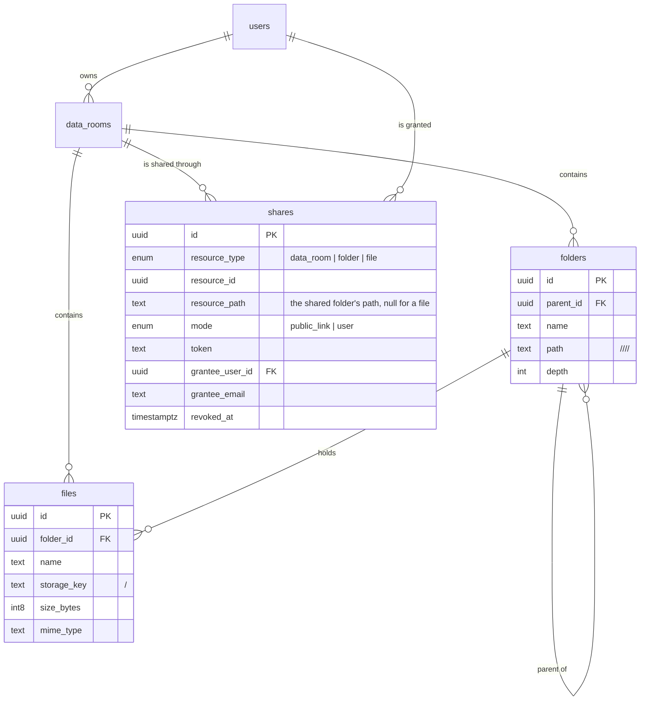

# Data Room

A virtual data room. Documents live in a private tree, and the owner decides who
can see which part of it: a person by email, or anyone holding a link. Access
granted on a folder reaches everything inside it and nothing beside it.

- Live app: `TBD`
- API: `TBD`


## Try it

| Account | Password | Sees |
| --- | --- | --- |
| `demo@dataroom.dev` | `dataroom-demo-2026` | owns Project Atlas |
| `reader@dataroom.dev` | `dataroom-demo-2026` | invited to `03 Legal` only |

Public link, no account needed: `/l/atlas-q4-2025-review`

Three things worth opening:

1. Sign in as the reader. The room opens at `03 Legal`, the folder they were
   given. `04 Commercial` answers 404, and the breadcrumbs do not name the
   folders above.
2. As the owner, open `02 Financials / Q4 2025`. A banner says the folder is
   shared, and every row carries a rail on its left because its access came from
   the folder, not from the row.
3. Drop two files into a folder where one of the names is already taken. The
   queue asks per file: keep both, replace, skip.


## Stack

- React 19, Vite, TypeScript, Tailwind v4, shadcn/ui, TanStack Query
- Fastify, Prisma, Postgres
- Supabase for auth, Postgres and object storage
- Vercel for both apps

## Running it locally

```bash
git clone <repo> dataroom && cd dataroom
npm install

cp .env.example .env      # fill in from the Supabase dashboard

npm run migrate --workspace @dataroom/api    # applies the one migration
npm run seed --workspace @dataroom/api       # demo room, two accounts, sample documents
npm run dev                                  # api on :8787, web on :5173
```

Supabase project setup, once:

- Storage: a private bucket named `files` with a 50 MB per file limit.
- Auth: email confirmation off, so the demo accounts can sign in immediately.
- API: the Data API (PostgREST) switched off. See the decisions below.

Checks:

```bash
npm run typecheck --workspaces      # api and web
npm run test --workspaces           # 39 unit tests over the path and access rules
npm run smoke --workspace @dataroom/api   # end to end against the real database and bucket
```

`smoke` creates two throwaway accounts, walks the whole API including a real
upload and download, asserts 44 things and deletes what it made. It needs a
filled in `.env`, so CI runs the unit tests only.

## The data model



Three decisions carry the whole thing.

**A folder's place in the tree is a materialized path of ids**, not of names:
`/<root>/<child>/<self>/`, slash terminated so that `/a/` cannot prefix match
`/ab/`. Renaming a folder therefore touches one row and never rewrites a
subtree, and any subtree is a single `LIKE 'prefix%'` scan. The index on `path`
uses `text_pattern_ops`, because a default collation btree cannot serve that.

**A file's object key is `<room_id>/<file_id>`**. Renaming or moving a file never
touches storage, and deleting a room is one prefix sweep of the bucket.

**A share stores the path it was granted at.** Asking whether a node is reachable
is then an equality lookup rather than a walk.

## How access is resolved

`domain/access.ts` holds the rules and knows nothing about the database.
`permissions.ts` runs them against it. Every route goes through the same
function, and the public link routes go through it too, so a link holder and an
invited reader cannot drift apart.

For a target node, `lookupKeys` returns the keys a share would have to carry to
reach it: the path of every folder above it, its own path, and for a file its
own id. That is at most `depth + 1` strings. One query asks for live shares
matching any of them:

```sql
select ... from shares
where data_room_id = $1
  and revoked_at is null
  and grantee_user_id = $2
  and (resource_path in ($3, $4, ...) or (resource_type = 'file' and resource_id = $5))
```

Both halves are served by partial indexes over live rows only. When several
shares cover a node, the closest one wins, because that is the one the interface
names: a share on the file beats a share on its folder, which beats a share on
the room.

The test that matters most is the one asserting a share of one branch does not
reach a sibling branch. That leak is the reason the model exists.


## How it scales

**A room with 100,000 files and a deep tree.** Listing one folder is an index
scan on `(parent_id)` and `(folder_id)`; it does not care how large the room is.
"Everything under this folder", which the delete manifest and the share sweep
need, is one prefix scan.

Rejected: a plain adjacency list, where every listing walks the tree with a
recursive CTE and gets slower as the tree deepens. Also rejected: a closure
table, which reads beautifully but writes `descendants x ancestors` rows on every
move and multiplies the row count for a tree that is mostly read.

The price of the choice is that moving a folder rewrites the paths of its
subtree. That is one statement, and moves are rare next to renames, which cost
nothing because paths are built from ids.

Not built: keyset pagination on a folder listing. Past a few thousand children
the endpoint should page on `(folder_id, name)`, and that index already exists.

**Many people and many shares.** Access is the one indexed query above, so its
cost follows the depth of the node, not the number of shares in the room or the
number of files under them.

Rejected: materialising an ACL row per node per grantee. Sharing a room with
100,000 files would write 100,000 rows, and revoking would write them again.
Rejected too: walking up the tree in the application, which is one round trip per
level.

The price is the copy of `resource_path` on the share. When the shared folder
moves, that copy has to move with it, which happens in the same transaction as
the move. Miss it and readers silently lose access; the smoke test covers it.

The listing annotates rows by loading the room's live shares once and evaluating
the same rules in memory. A room holds tens of shares, not thousands, so this is
one query rather than one per row. If that stopped being true, the same answer
comes from a `resource_path in (...)` over the listed rows.

**Large files, several at once.** The browser asks the API for a signed URL and
uploads straight to storage. Bytes never pass through a function, so no request
body limit applies, progress is measured rather than animated, and three uploads
run at a time.

Rejected: multipart through the API. A serverless function caps the body at a few
megabytes and holds the whole file in memory while it proxies it.

Size and type are read back from storage rather than trusted from the request, so
the row describes what is actually there. The limit is checked when the upload is
asked for, again against what storage reports, and a third time by the bucket,
which is the one a client cannot argue with.

Not built: resumable uploads. Supabase Storage speaks TUS; the queue here retries
a whole file instead.

## Decisions and trade-offs

**No NestJS.** I told the team I have not run it in production, and building the
submission on it would have contradicted that. Fastify with a thin layer of my
own is smaller and I can defend every line of it.

**The Supabase Data API is switched off.** The publishable key ships inside the
frontend bundle. With PostgREST on, auto exposure of new tables, and no row level
security, every table in this schema would be readable and writable straight past
the API. Everything goes through the API instead, which holds the service role
key on the server. Row level security would be the other answer; it belongs to a
design where the browser talks to Postgres, and this one does not.

**Prisma owns the schema, but not all of it.** Prisma models neither partial
indexes nor check constraints, and both carry weight here: one root folder per
room, indexes over live shares only, and a constraint that a public link has a
token while an invitation has a recipient. Those are hand written at the tail of
the migration, under a comment saying so.

**UUIDv7, generated in the application.** The ids appear in URLs and in every
path, so they have to be opaque, but they are also primary keys on tables that
grow, and v4 scatters btree inserts across the whole index. `pg_uuidv7` is not
available on Supabase, so the application generates them.

**A node you may not see answers 404, not 403.** A 403 would confirm that a
folder with that id exists, which is exactly what a shared out data room must not
leak.

**Shares are revoked, not deleted.** Someone holding a dead link is told it was
switched off instead of walking into a blank 404, and the partial indexes stop
considering the row either way.

**A reader is not told who else has access.** The access column and the people
count are built for the owner only, and the room list hides totals for a room
someone was invited into, because those totals describe parts they cannot see.


## Not built, on purpose

- **Roles beyond viewer.** The enum has one value and a check constraint that
  fails closed, so adding an editor is a migration and one branch rather than a
  rewrite of the access rules.
- **Search.** `pg_trgm` on `files.name` is the shape of the answer.
- **File versions.** Replacing a file overwrites the object and keeps the row, so
  every link that pointed at it still does. Keeping the old bytes is a column and
  a second key.
- **An audit trail of who opened what.** Shares are already append plus revoke,
  which is the same shape.
- **Sweeping orphaned objects.** An upload the reader abandons leaves an object
  with no row behind it. In a real deployment a nightly job compares the bucket
  against `files`.
- **Rate limiting on the link routes.** A token is 32 characters of base64url,
  so guessing one is not the threat; a link being hammered is, and that is a
  counter in Redis rather than in a serverless instance's memory.
- **Storybook, an e2e suite, Docker.** The style reference in
  `docs/design/style-reference.html` is the component gallery, and the smoke
  script covers the paths an e2e suite would.

Two things a reviewer will notice:

- `npm audit` reports a high severity advisory in `deepmerge-ts`, reached only
  through `@prisma/config`, which is a dependency of the `prisma` CLI in
  `devDependencies`. It is not in the runtime tree. `npm audit fix --force`
  downgrades Prisma across a major version, so it stays.
- Email confirmation is off in Supabase Auth, deliberately, so that the demo
  accounts and any account a reviewer creates work immediately.

## Where AI was used

I built this with Claude Code as a pair, and I am saying so because you would work
it out from the commit rhythm anyway.

What stayed mine: the data model, the access rules and their failure modes, the
visual language, which is carried over from a project of my own, and every
trade-off written down above.

What it did well: most of the typing, the sample document generator, the seed,
and the first pass at the tests.

What it got wrong and I caught: a test that asserted a fact about JavaScript
rather than about my code, whole room totals shown to someone invited into one
folder, and readers landing on a root folder they are not allowed to open.
